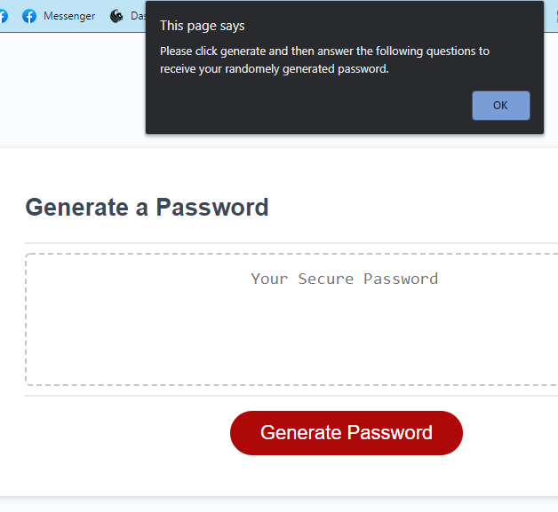

# Random Password Generator

## Installation

This is a browser based product that uses javascript to function.
​
## Usage 
​
This product was designed to generate a random password following certain guidelines.

Once on the page, an alert will explain how to get through the quetions to recieve your password. 

Click generate to begin
Enter desired length of password
Enter yes or no for uppercase
Enter yes or no for lowercase
Enter yes or no for special characters
Password will be generated

## Built With
* HTML
* CSS
* Javascript

## Website
https://kalib-hicks.github.io/RandomNumberGenerator/

​
​
## Credits
​
Tutorials:
https://codepen.io/dev_loop/pen/vYYxvbz
https://www.theamplituhedron.com/projects/JavaScript-Random-Password-Generator/
https://developer.mozilla.org/en-US/docs/Learn/JavaScript/Building_blocks/conditionals

​
​
​
